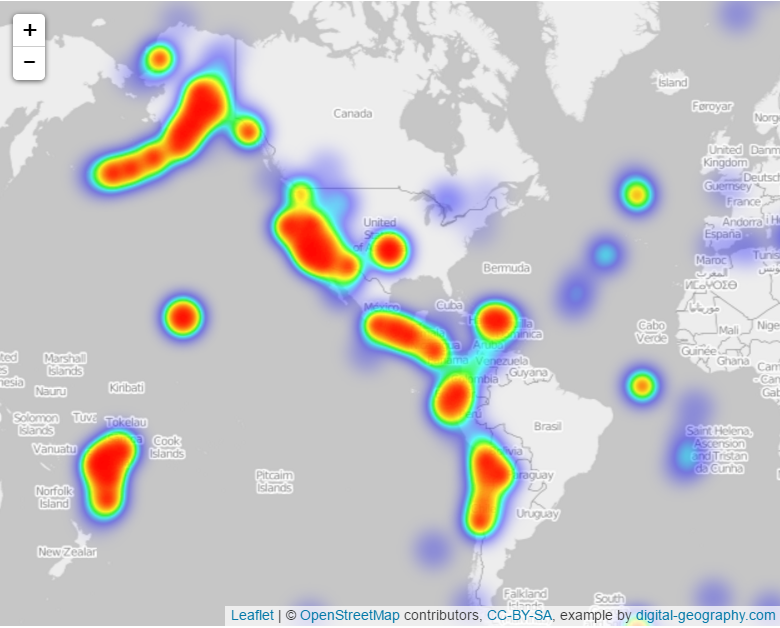

# Earthquake Data Visualization with Leaflet

This project visualizes global earthquake data provided by the United States Geological Survey (USGS) through a variety of interactive maps. The goal is to help educate the public on earthquake occurrences worldwide, assist government organizations in assessing natural hazards, and showcase earthquake data in a visually meaningful way that highlights trends, patterns, and intensities of seismic activity. This project is intended to increase awareness of geological activity and support the USGS in securing funding for further research.

## Table of Contents

1. [Project Overview](#project-overview)
2. [Technologies Used](#technologies-used)
3. [Data Sources](#data-sources)
4. [Visualizations](#visualizations)
5. [Setup Instructions](#setup-instructions)
6. [Running Specific Logic Files](#running-specific-logic-files)
7. [File Structure](#file-structure)

## Project Overview

The United States Geological Survey (USGS) collects vast amounts of data about natural hazards such as earthquakes, climate change impacts, and land-use change. In this project, we use USGS earthquake data to create visualizations that make the data accessible and engaging for general audiences and government organizations. By using different types of interactive maps, we aim to present earthquake data in ways that highlight critical features, such as depth, magnitude, clustering, and tectonic activity.


## Technologies Used

- **Leaflet.js**: A powerful JavaScript library for interactive maps.
- **D3.js**: Used for handling and binding data to Leaflet layers.
- **Mapbox**: Provides additional map styles, such as satellite views, to enhance map aesthetics.
- **Leaflet Plugins**:
  - `leaflet.markercluster`: Used for clustering earthquake data points to improve map readability.
  - `leaflet.heat`: Used to create a heatmap that highlights areas with high earthquake activity.

## Data Sources

All earthquake data is sourced from the USGS GeoJSON feed, which updates earthquake data weekly:
- [USGS Earthquake GeoJSON Feed](https://earthquake.usgs.gov/earthquakes/feed/v1.0/summary/all_week.geojson)

This data feed provides information on earthquake locations, magnitudes, depths, and more, allowing us to visualize both individual earthquake events and larger patterns in seismic activity.

## Visualizations

This project includes multiple visualizations, each with a distinct perspective:

### 1. Heatmap of Earthquakes
The heatmap visualization provides an overview of earthquake intensity globally. Areas with higher earthquake magnitude are displayed with warmer colors, transitioning from blue for lower magnitudes to red for the highest magnitudes.



**Code File**: `logic3.js`  
**Description**: The `logic3.js` script uses `leaflet.heat` to create heat blobs representing earthquake activity. Magnitude influences the intensity of each blob, offering a clear visual representation of areas with concentrated seismic activity.

### 2. Clustered Earthquake Map
The clustered earthquake map groups nearby earthquakes and color-codes them by depth. This clustering technique allows users to explore seismic data at a broader level and examine clusters in high-seismic regions.


**Code File**: `logic.js`  
**Description**: The `logic.js` script leverages `leaflet.markercluster` to dynamically group earthquake points into clusters. Clusters adjust as the user zooms in and out, and each earthquake marker color represents the depth of the event.

### 3. Basic Earthquake Map
The basic earthquake map uses circle markers to display individual earthquakes. Marker color reflects the depth of the earthquake, and marker size correlates with magnitude, providing insights into the intensity of each earthquake.


**Code File**: `logic2.js`  
**Description**: This script generates a simple map with customizable color and radius properties for each earthquake marker. It includes a legend for earthquake depth and provides an overlay of tectonic plates, aiding in understanding earthquake locations relative to tectonic boundaries.

## Setup Instructions

1. Clone the repository to your local machine:
   ```bash
   git clone https://github.com/manahilr701/leaflet-challenge.git
